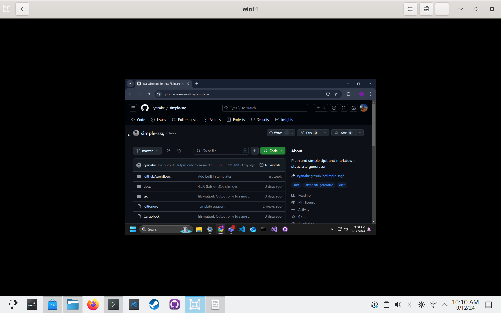

+++
title = 'Trying out a Fedora base image for a week'
date = 2024-09-12T18:30:10-05:00
draft = true
+++

# Using a Fedora atomic base image for a week

I decided this unmomentous occasion is something I'd like to document, to talk about where the atomic experience could be better, and where it really shines!

For context, I daily drive Fedora Atomic Desktops, I use a [custom image](https://github.com/ryanabx/ryanabx-containers/blob/main/main-os/Containerfile) that includes things like Visual Studio Code, Fedora packaging tools, my dev dependencies (the principle of which being Rust and its tools), virt-manager and qemu for work, and much more!

I am challenging myself to lean into the "atomic" way of doing things, which is typically to install all your software in containers and flatpaks. I want to see how difficult it will be to run some of my typical workflows without my custom container image!

## Motivation

I decided to start this challenge on a whim, after having a wonderful conversation with Neal Gompa and some others about image-based operating systems (spoiler alert, Neal is not a fan of pure image-based OSes for desktop devices). I'm (currently, always subject to change) of the viewpoint that image-based is the eventual future of operating systems, but Neal brought up many good points as to why the model doesn't pan out like expected. My understanding of his points were as follows:

> **NOTE:** These are problems that are partially solved by `rpm-ostree`, but `rpm-ostree` is a partial hack that doesn't truly match the image-based paradigm.

- Image-based OSes are generally very inflexible
- Image-based OSes are good when you have an appliance that performs a specific purpose, and has specific hardware.
  - Neal mentioned the Steam Deck, and I think that's an excellent example. He also mentioned IoT devices.
- Local customization is a chore, because you're fighting against a model that is designed to be "rigid and avoid hysteresis".
- "Systems that can't outlive their initial lifetime become waste eventually, and that's fundamentally a problem with image based systems"
  - My interpretation of this is that the system only is as good as the upstream maintenance of the image, because otherwise you're locked to the versions of packages that are installed from the base image due to lack of mutability.
- "You are fully at the mercy of someone who may or may not care about your needs"
  - This also plays into hardware enablement, as with a truly image-based system you are not able to enable your own custom hardware without the image itself supporting it.
  - We see downstreams like Universal Blue adding hardware enablement into the image itself largely because they have to. `rpm-ostree` is a thing, but without that, nvidia users for example wouldn't have a choice between using the base images vs an image that ublue makes.

It's hard to disagree that image-based OSes are designed to be rigid, that's quite literally the point. We also often see images become hyper-customized for a specific use case, without reusing bits between them. This is one of those problems that might be seen as fundamental to the image-based paradigm. I think Neal is right about the limitations of the paradigm, I think the question for me is whether the tradeoffs actually matter to end-users, especially because we build solutions around the limitations of the image being rigid, such as local modifications to the base image (which is what `rpm-ostree` essentially does).

The common rebuttal I see in the Fedora atomic world is that you shouldn't be modifying your base system -- you should put everything in your home space. This means using flatpaks and containers in every step of your computing experience. I've traditionally found this not to be very easy to set-up, mainly in a few problem areas which I will be addressing:

#### Virtual Machines

Oftentimes I'll struggle to set up virtual machines because the required software to do so is best installed through a traditional package manager. Both `virt-manager` and `virtualbox` are pretty standard options to use in the Linux world. The flatpak alternative is `gnome-boxes`, but we will get to that later.

#### Container-based development

More specifically with Visual Studio Code's flatpak. This is 100% a problem that should have been solved by now, but the experience of getting a container-based workflow set up in vscode's flatpak is a nightmare to say the least. We will also get to that later.

## Night 1

I started this challenge due to lack of sleep, it's currently 2 AM on a Thursday. I have work tomorrow, and I just rebased to the base kinoite image `fedora:fedora/40/x86_64/kinoite`.

After doing this initial write-up in `KWrite`, since I've lost access to my rpm installation of Visual Studio Code, I will be installing the vscode flatpak (begrudgingly). Luckily for me, all of the infrastructure for me to make a custom development container is already present in my [container repo](https://github.com/ryanabx/ryanabx-containers), I just need to modify my old dev container to have some new dev dependencies I rely on.

I should also note that I'm not installing the proprietary Nvidia drivers for this journey. I'm going full base image. I'm essentially pretending `rpm-ostree` doesn't exist, to get the full image-based experience. If the open source nouveau + NVK stack weren't stable, I'd be in for a truly crappy experience. This is part of what Neal was mentioning as an issue of truly image-based systems. All workarounds (i.e. `rpm-ostree`) are just that, workarounds to the image-based paradigm.

I'm going to install the vscode flatpak and go to sleep. I will have to solve the virtual machine problem tomorrow, but as a backup I won't hesitate to just use my desktop computer which has my custom image on it.


Already I have run into an issue. `git-lfs` is not installed on the base image. I will have to enter a podman container to initialize git-lfs on this repository, which I'd like to do in order to not track images in an inefficient manner. Alas, I will have to figure out podman containers now.

This is the container I came up with -- it just takes what's in my ostree container image and removes the OS stuff, like vscode and virt-manager:

```Dockerfile
FROM fedora:40

RUN dnf install -y \
    # Git lfs
    git git-lfs \
    # Rust stuff
    rust cargo rust-analyzer rustfmt clippy \
    # Dev dependencies
    wayland-devel libxkbcommon-devel fuse-devel \
    squashfs-tools gstreamer1-plugins-base-devel \
    gdk-pixbuf2-devel pango-devel gtk3-devel glib2-devel \
    lld make automake gcc gcc-c++ clang clang-devel mold kernel-devel glibc-devel binutils binutils-devel binutils-gold \
    # Git forge CLIs
    gh pagure-cli \
    # Fedora packaging stuff
    fedpkg fedora-packager \
    # Phone dev tools
    android-tools pmbootstrap \
    # Requirement for bootc image builder
    osbuild-selinux \
    # Ruby
    ruby ruby-devel \
    # Node.js
    nodejs \
    # cosmic-comp devel
    libseat-devel pixman-devel \
    # KDE devel
    cmake
```

This (if it builds correctly) will be my base for my development containers.

Does using a custom dev container image defeat the purpose? I personally don't think so. Someone could just pull a base fedora container image as their dev container, and then install what they need inside it anyways. I'm just streamlining it by making my own custom image.

Instead of committing to my blog repo tonight, I'm going to go to sleep.

## Day 1

I woke up late for my work day, it looks like my alarm didn't go off, or I slept through it?

After installing `gnome-boxes`, which to my knowledge is the only VM software available on FlatHub, it's time to try to get to work.

My first gripe I've found is that the VM is locked to 1280x800. I don't know why this is, but I will be looking it up to find out. Gnome Boxes should handle this automatically though, I shouldn't have to look it up, but alas that's how Linux works sometimes.



Also, touchpad scroll events don't seem to be propagated to the VM, which is very annoying.

Online, it was recommended that I install the [spice guest tools for windows guests](https://spice-space.org/download.html). Installing this driver fixed my issue with the screen being too small. I think `gnome-boxes` should have at least a notice about it in their app. Virtualbox has a whole button dedicated to installing guest utilities.

Not only does the VM have great resolution now, it also solved my framerate issue I've had with QEMU in the past where the FPS was locked to an arbitrary low value. Thanks Gnome Boxes!

> **EDIT:** No it did not, turns out it just made the mouse passthrough faster. The framerate issue still exists.

Scrolling was also weirdly fixed after installing the guest utilities? It's weird that so many things required the guest utilities to function properly, but I'm just glad I can get some work done.


I need more space on my VM. Normally I would use qemu-img for this, but it's not installed on the base system. Luckily I know that `gnome-boxes` needs qemu to work, so I can just use `qemu-img` from within the flatpak. Here's how I did that:

```
flatpak run --command=/bin/bash org.gnome.Boxes
qemu-img resize VirtualMachines/win11.qcow2 +20G
```

Thanks again, Gnome Boxes!

## More Interesting Comments re: Image-based discussion

I'm happy to be a part of circles where I can witness nuanced discussion about different topics. Today, Timothee Ravier, who contributes heavily to Fedora Kinoite has provided his commentary on what Neal said yesterday.

My likely botched interpretation of what he said (similar to Neal):

- On the topic of local customization, Timothee says that `rpm-ostree` has multiple mechanisms for local customization and that `systemd-sysext` should covert that ground as well in the future.
- On the topic of systems not being able to outlive their original lifetime, he says he doesn't know how a Kinoite system would have a different lifetime than a Fedora KDE installation.
  - He says that the lifetime problem on Android and Chromebook devices doesn't come from the fact that they are immutable, but rather from the fact that they are secure, thus you have to have the keys or disable signature checks to change what's on them if the manufacturer doesn't produce updates.
- Regarding this quote from Neal:
  
  > one of the "escape hatch" things we have with the current model is that we don't have to have a solution for everyone out of the box, people can change the system to suit their needs

  Timothee says:

  > This is exactly why we're making bootc. Everyone will be able to customize the system to feet their needs while keeping the benefits of image based systems

  I should add that `bootc` is very exciting to me, as an alternative to `rpm-ostree`'s model of customization.
- In response to this from Neal:

  > Anything premount of theoretical writable overlays is screwed

  Timothee says:

  > You can change the content of the initramfs with rpm-ostree and with bootc you'll be able to directly install customized images like that, and with kiwi support generate ISO/disk images

The discussion leaves me with seeing the pros and cons of image-based systems, but also leaves me more excited than ever for the [bootc project](https://github.com/containers/bootc). As a bonus, it's written in rust, which if you know me rust is my favorite language.

## Bootc Try-out?

Speaking of bootc, I'd like to give bootc a try. I've created a minimal base image [here](https://github.com/ryanabx/ryanabx-containers/tree/main/kde-bootc/Containerfile). All it does is take the base image and install the KDE plasma desktop on top of it. How hard would it be to migrate my existing system to bootc? Let's find out.

My first attempt is going to be simply installing bootc and running `bootc switch` to switch to the new image. I have no idea if this will work, but let's see!

```
sudo rpm-ostree install bootc
systemctl reboot
sudo dnf install bootc
sudo bootc switch ghcr.io/ryanabx/kde-bootc:latest
```

The first try didn't work out, all I got was a single underscore in the top left corner, couldn't even enter a TTY.

I checked the bootc documentation and found this from [this section](https://containers.github.io/bootc/bootc-install.html#using-bootc-install-to-existing-root):

```
podman run --rm --privileged -v /dev:/dev -v /var/lib/containers:/var/lib/containers -v /:/target \
             --pid=host --security-opt label=type:unconfined_t \
             <image> \
             bootc install to-existing-root
```

I'm a little nervous to try this, but I'm going to try it out.

## Day 1 Evening

Do not, I repeat. DO NOT try what I tried, if you have a 